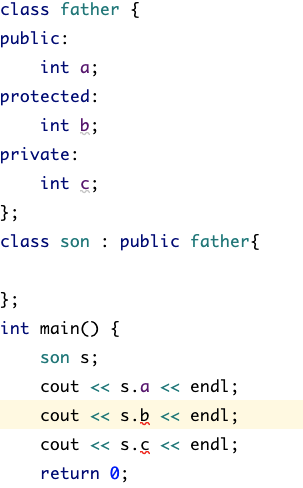
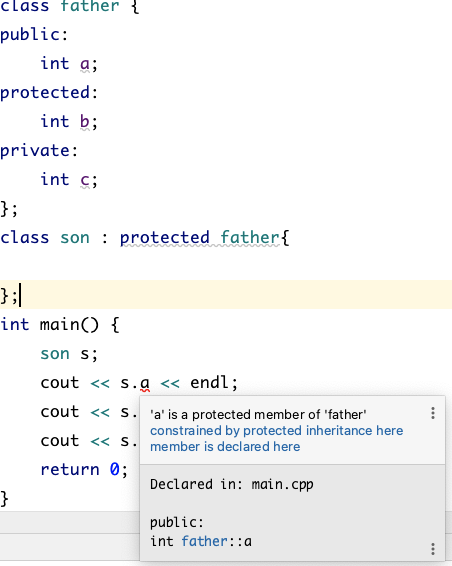
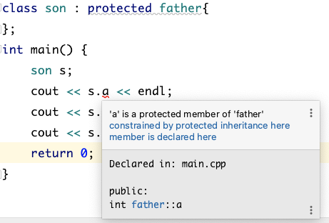
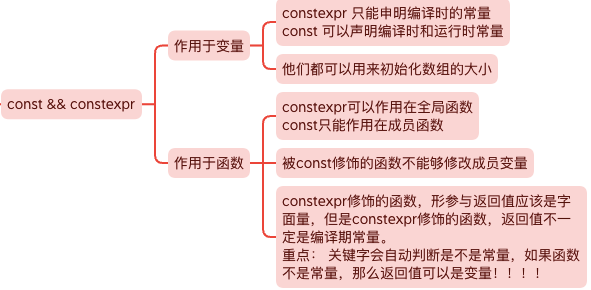
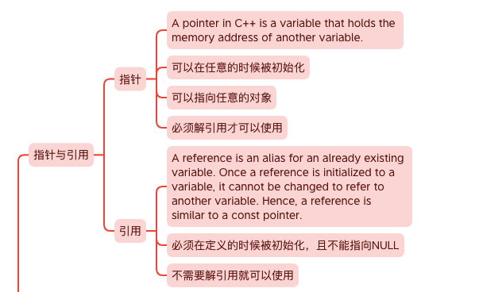
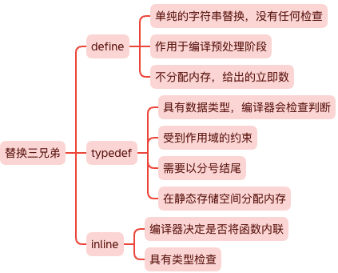
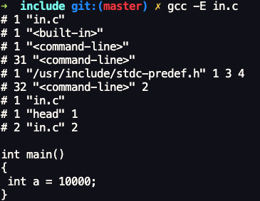
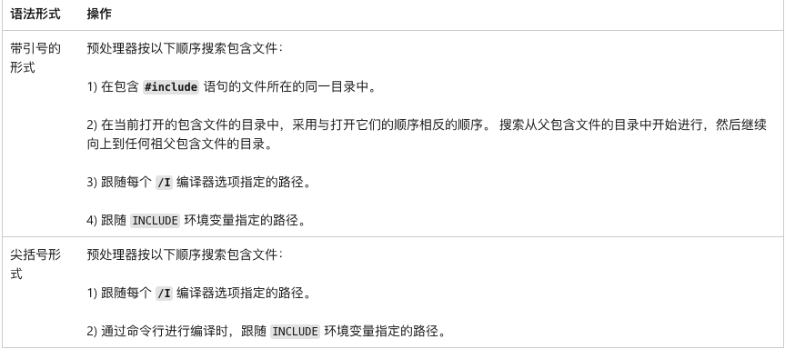
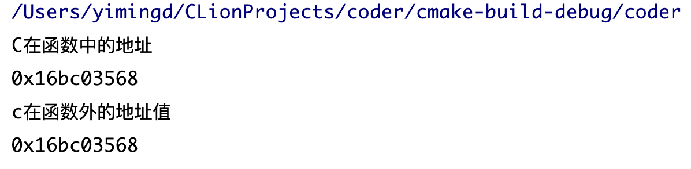
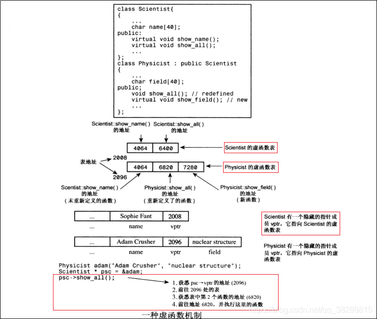

# C++基础知识

[思维导图](../MindMap/C++.xmind)

[大佬的学习路线](https://blog.csdn.net/weixin_49199646/article/details/115557817?spm=1001.2014.3001.5502)

## 1.指针与数组

Q1: 数组的首地址的含义是什么 `arr, &arr[0], &arr`

````cpp
    int arr[10]={0};
    printf("%p\n",arr);//首元素的地址
    printf("%p\n",arr+1);
    // 这两种表达是等价的
    printf("%p\n",&arr[0]);//首元素的地址
    printf("%p\n",&arr[0]+1);

    printf("%p\n",&arr);//整个数组元素的地址
    printf("%p\n",&arr+1); // 输出为 arr + 10
````

Q2: `char *a`, `char **a`, `char (*a)[]`, `char a[]`, `char a[][]`之间的关系

​	**区分的关键在于，记住[]的优先级大于*.**

不管是一维还是多维数组，都是内存中一块线性连续空间，**因此在内存级别上，其实都只是一维。**

所以一维数组名是指向该数组的指针，二维数组名也是指向该数组的指针，但是+1之后，跳过的是一行。

Q3: 二维数组名为什么不能直接赋值给二级指针？

答：一句话来说就是**二维数组名是行指针，也就是指向数组的指针。而二级指针是指向指针的指针，它们不是同一类型。**

> 定义一维数组 `int a[i]` 和二维数组` int b[i][j]`，a相当于`int (*)`，而b相当于`int (*)[j]`。想要获得 a[i] 中第 x 个元素，可以直接使用 `*(a+x)`。而想要获得 `b[i][j] `中第 x 行第 y 个元素，则需用 `*(*(b+x)+y)`，因为 b 相当于数组指针，(b+x) 则是指向第 x 个数组的指针，注意，是指向数组，而不是数组元素！所以` *(b+x)` 获得的是第 x 个数组的数组名，即该数组的首元素地址，这时再结合偏移量 y 就可以取得该元素。

````cpp
#include <iostream>

using namespace std;

int main()
{
    cout << "=============" << endl;
    char a[] = "你好，全民制作人";
    char *b, tp[] = "我是蔡徐坤";
    char e = 'a', f = 'k';

    // b可以是指向数组的指针，也可以是指向变量的指针
    b = &e;
    printf("b可以是一个字符指针:%c \n", *b);
    // 在C++中，数组给指针赋值的时候，会降级为指向第一个元素的指针
    // 这个行为在反过来的时候是错误的
    // a = b; wrong!
    b = a;  // 当b指向a 他们直接没有任何区别
    printf("b指向数组: %s \n", b);
    printf("b也可以像a一样指向某个元素 %c \n", b[2]);
    

    char *c[2] = {a, tp}; // []的优先级大于* 因此这是一个指针数组
    char **d; // d同样有2种理解的方式，一个是二级指针，另一个是指向指针数组的指针 \
    也就是d和c是等价的

    b = &e; // b 再次指向一个字符
    d = &b;
    printf("修改之前 %c \n", **d);
    *d = &f; //让b指向f
    printf("修改之后 %c \n", *b);

    printf("这是指针数组中的内容: %s, %s \n", c[0], c[1]);
    d = c;
    printf("d 和 c是等价的 %s, %s \n", d[0], d[1]);

    char x[2][10] = {"丁真", "理塘"};
    char (*y)[10] = x; // 我们修改*的优先级，这样y首先是一个指针 \
    然后它指向了一个10个元素的数组，这就是二维数组
    printf("这是一个二维数组的指针: %s, %s \n", y[1], y[0]);

}
````


### 为什么不使用原始数组，而是vector or array

Raw arrays in C++ are kind of annoying and fraught with peril. This is why unless you have a very good reason to you should use `std::vector` or `std::array`.

First off, as others have said, `char[2]` is not the same as `char*`, or at least not usually. `char[2]` is a size 2 array of `char` and `char*` is a pointer to a `char`. They often get confused because arrays will decay to a pointer to the first element whenever they need to. So this works:

```cpp
char foo[2];
char* bar = foo;
```

But the reverse does not:

```cpp
const char* bar = "hello";
const char foo[6] = bar; // ERROR
```

Adding to the confusion, when declaring function parameters, `char[]` is equivalent to `char*`. So in your constructor the parameter `char short_name[2]` is really `char* short_name`.

Another quirk of arrays is that they cannot be copied like other types (this is one explanation for why arrays in function parameters are treated as pointers). So for example I can *not* do something like this:

```cpp
char foo[2] = {'a', 'b'};
char bar[2] = foo;
```

Instead I have to iterate over the elements of `foo` and copy them into `bar`, or use some function which does that for me such as [`std::copy`](http://en.cppreference.com/w/cpp/algorithm/copy):

```cpp
char foo[2] = {'a', 'b'};
char bar[2];
// std::begin and std::end are only available in C++11
std::copy(std::begin(foo), std::end(foo), std::begin(bar));
```

So in your constructor you have to manually copy the elements of `short_name` into `short_name_`:

```cpp
Territory::Territory(std::string name, char* short_name, Player* owner, 
                     char units) : name_(name), owner_(owner), units_(units)
{ 
    // Note that std::begin and std::end can *not* be used on pointers.
    std::copy(short_name, short_name + 2, std::begin(short_name));
}
```

As you can see this is all very annoying, so unless you have a very good reason you just should use `std::vector` instead of raw arrays (or in this case probably `std::string`).


## 2.c++三大特性

### **封装**

最开始接触代码是C语言，那么开始写一些逻辑代码的时候会很麻烦，因为你要在函数中定义变量，然后按顺序写对应的逻辑，接着可以将逻辑封装成函数。当时会感觉很麻烦，因为很散装，知道后面学了struct结构体，把对应逻辑需要的数据可以放到一个结构体里面，这样就会比较好看。接着出现的问题就是数据封装到了一起，但是处理数据对应的逻辑即函数却还是在外面。因此就有了将数据和对应逻辑进行封装的类的出现。

封装就是将抽象得到的数据和行为相结合，形成一个有机的整体，也就是将数据与操作数据的源代码进行有机的结合，形成类，其中数据和函数都是类的成员，目的在于将对象的使用者和设计者分开，可以隐藏实现细节包括包含私有成员，使得代码模块增加安全指数，同时提高软件的可维护性和可修改性。

所以总结来说封装这个特性包含两三特点：

1. 结合性，即是将属性和方法结合
2. 信息隐蔽性，利用接口机制隐蔽内部实现细节，只留下接口给外界调用
3. 实现代码重用

### **继承**

类的派生指的是从已有类产生新类的过程。原有的类成为基类或父类，产生的新类称为派生类或子类，子类继承基类后，可以创建子类对象来调用基类的函数，变量等。

一般来说有如下三种继承方式：

1. 单一继承：继承一个父类，这种继承称为单一继承，这也是我们用的做多的继承方式。
2. 多重继承：一个派生类继承多个基类，类与类之间要用逗号隔开，类名之前要有继承权限，假使两个或两个基类都有某变量或函数，在子类中调用时需要加**类名限定符**如obj.classA::i = 1；
3. 菱形继承：多重继承掺杂隔代继承1-n-1模式，此时需要用到虚继承，例如 B，C虚拟继承于A，D再多重继承B，C，否则会出错。后面有将具体虚继承怎么做。

此外还有继承权限的问题，如下图：

> public、protected、private三种继承方式，相当于把父类中的，比继承权限大的权限在子类中变成了继承时的权限。



[](https://camo.githubusercontent.com/2ac72d71dc9735144f15b03ce2c9ec548f6e01885a0adc2185d9765217bd9ffd/68747470733a2f2f696d61676573323031352e636e626c6f67732e636f6d2f626c6f672f313034383433302f3230313631312f313034383433302d32303136313130373039353635373238302d313531393131323032392e706e67)

### **多态**

可以简单概括为“一个接口，多种方法”，即用的是同一个接口，但是效果各不相同，多态有两种形式的多态，一种是静态多态，一种是动态多态。

静态多态。静态多态的设计思想：对于相关的对象类型，直接实现它们各自的定义，不需要共有基类，甚至可以没有任何关系。只需要各个具体类的实现中要求相同的接口声明，静态多态本质上就是模板的具现化。

动态多态。对于相关的对象类型，确定它们之间的一个共同功能集，然后在基类中，把这些共同的功能声明为多个公共的虚函数接口。各个子类重写这些虚函数，以完成具体的功能。具体实现就是c++的虚函数。

多态是以封装和继承为基础实现的性质，一个形态的多种表现方式。硬要解释的话可以说是一个接口，多个功能，在用父类指针调用函数时，实际调用的是指针指向的实际类型（子类）的成员函数。

c++多态有以下几种：

1. 重载。函数重载和运算符重载，编译期。

2. 虚函数。子类的多态性，运行期。

   在继承关系中，对于父类的方法我们也同样使用。但是正常来说，我们希望方法的行为取决于调用方法的对象，而不是指针或引用指向的对象有关。

3. 模板，类模板，函数模板。编译期

> 比如你家有亲属结婚了，让你们家派个人来参加婚礼，邀请函写的是让你爸来，但是实际上你去了，或者你妹妹去了，这都是可以的，因为你们代表的是你爸，但是在你们去之前他们也不知道谁会去，只知道是你们家的人。可能是你爸爸，可能是你们家的其他人代表你爸参加。这就是多态。

## 3.面向对象和面向过程语言的区别

首要要知道这两个都是一种编程思想

**面向过程**就是分析出解决问题所需要的步骤，然后用函数把这些步骤一步一步实现，使用的时候一个一个依次调用就可以了。

**面向对象**是把构成问题事务分解成各个对象，建立对象的目的不是为了完成一个步骤，而是为了描叙某个事物在整个解决问题的步骤中的行为。

**举一个例子：**

例如五子棋，面向过程的设计思路就是首先分析问题的步骤：1、开始游戏，2、黑子先走，3、绘制画面，4、判断输赢，5、轮到白子，6、绘制画面，7、判断输赢，8、返回步骤2，9、输出最后结果。把上面每个步骤用分别的函数来实现，问题就解决了。

而面向对象的设计则是从另外的思路来解决问题。整个五子棋可以分为 1、黑白双方，这两方的行为是一模一样的，2、棋盘系统，负责绘制画面，3、规则系统，负责判定诸如犯规、输赢等。第一类对象（玩家对象）负责接受用户输入，并告知第二类对象（棋盘对象）棋子布局的变化，棋盘对象接收到了棋子的i变化就要负责在屏幕上面显示出这种变化，同时利用第三类对象（规则系统）来对棋局进行判定。

可以明显地看出，面向对象是以功能来划分问题，而不是步骤。同样是绘制棋局，这样的行为在面向过程的设计中分散在了总多步骤中，很可能出现不同的绘制版本，因为通常设计人员会考虑到实际情况进行各种各样的简化。而面向对象的设计中，绘图只可能在棋盘对象中出现，从而保证了绘图的统一。功能上的统一保证了面向对象设计的可扩展性。

**面向过程**

优点：性能比面向对象高，因为类调用时需要实例化，开销比较大，比较消耗资源;比如单片机、嵌入式开发、 Linux/Unix等一般采用面向过程开发，性能是最重要的因素。

缺点：没有面向对象易维护、易复用、易扩展

**面向对象**

优点：易维护、易复用、易扩展，由于面向对象有封装、继承、多态性的特性，可以设计出低耦合的系统，使系统 更加灵活、更加易于维护

缺点：性能比面向过程低

## 4.结构体(struct)和共同体(union)的区别

结构体struct：把不同类型的数据组合成一个整体。struct里每个成员都有自己独立的地址。sizeof(struct)是内存对齐后所有成员长度的加和。

共同体union：各成员共享一段内存空间, 一个union变量的长度等于**各成员中最长的长度**，以达到节省空间的目的。所谓的共享不是指把多个成员同时装入一个union变量内, 而是指该union变量可被赋予任一成员值,但每次只能赋一种值, 赋入新值则冲去旧值。 sizeof(union)是最长的数据成员的长度。

> 总结： struct和union都是由多个不同的数据类型成员组成, 但在任何同一时刻, union中只存放了一个被选中的成员, 而struct的所有成员都存在。在struct中，各成员都占有自己的内存空间，它们是同时存在的。一个struct变量的总长度等于所有成员长度之和。**在Union中，所有成员不能同时占用它的内存空间，它们不能同时存在。**Union变量的长度等于最长的成员的长度。对于union的不同成员赋值, 将会对其它成员重写, 原来成员的值就不存在了, 而对于struct的不同成员赋值是互不影响的。

### struct的内存对齐规则

[博客链接](https://cloud.tencent.com/developer/article/1703257)

### **为什么要字节对齐？**

需要字节对齐的根本原因在于CPU访问数据的效率问题。假如没有字节对齐，那么一个double类型的变量会存储在4-11上（正常是0-7）这样计算机取这个数据的会会取两次，降低效率。而如果变量在自然对齐位置上，则只要一次就可以取出数据。一些系统对对齐要求非常严格，比如sparc系统，如果取未对齐的数据会发生错误。

### **对齐规则**

有效对其值：是给定值#pragma pack(n)和结构体中最长数据类型长度中较小的那个。有效对齐值也叫**对齐单位**。

对齐规则

> 在没有#pragma pack这个宏的声明下，遵循下面三个原则：
>
> 1、第一个成员的首地址为0.
>
> 2、每个成员的首地址是自身大小的整数倍
>
> 3、结构体的总大小，为其成员中所含最大类型的整数倍。
>
> 在存在#pragma pack这个宏的声明时，
>
> 对齐值是 **结构体中成员长度最大的值和对其值的最小值**。


举例子：

```CPP
typedef struct A {
    char a;   //1+3
    int  b;    //4
    short c;    //2+2
		// 总大小12 A的对齐值为4
} AA;

#pragma  pack(8)
// 最大的长度为4字节 实际的对齐值为 4
struct test
{
  char a; // 1 + 3
  int  b; // 4
  short c; // 4
  // 总大小为: 12
};
```

**易错点**

```C++
//sizeof = 8
struct str{
    char p; // 1 + 3
    int a; // 4
    int b[0]; // 0
}

//sizeof = 4
struct str{
    int b[0];
}

//sizeof = 1
struct str{
    
}
```

### [空数组与空结构体](https://blog.csdn.net/LU_ZHAO/article/details/104225048)

上面三个结构体都包含空数组，空数组指的是长度为0的数组`int[]`或`int[0]`

这种定义只能在类或者结构体中定义，在外部是非法定义。空数组不占空间，也无需初始化

>  空数组名是一个指针，（但是又不占空间）指向一个位置；对于结构体，空数组名这个指针指向了前面一个成员结束的第一个空间。

空数组的用法，用来申请空间

````cpp
typedef struct st{
    int c;
    char a[0];
} s;

int main() {
    s *a = static_cast<s *>(malloc(sizeof(int) + 20));
    char *c  = a->a;
    c = "wo shi ikun";
    printf("%p  %s\n", &(a->c), c);
    return 0;
}
````


空类和空结构体为什么不能为空?

> “no object shall have the same address in memory as any other variable” ，就是任何不同的对象不能拥有相同的内存地址。 如果空类大小为0，若我们声明一个这个类的对象数组，那么数组中的每个对象都拥有了相同的地址，这显然是违背标准的。

### 结构体位域(bitfield)

C/C++中以一定区域内的位(bit)为单位来表示的数据成为位域，**位域必须指明具体的数目**。

位域的作用主要是节省内存资源，使数据结构更紧凑。

1. 位域的值不能超过数据本身的最大值。
2. 我们无法获取位域的地址。
3. 对位域的元素赋超过的值 会发生数据的截断，而不会覆盖。

位域的使用规则：

> 1. 如果相邻位域字段的类型相同，且其位宽之和小于类型的sizeof大小，则后面的字段将紧邻前一个字段存储，直到不能容纳为止；
> 2. 如果相邻位域字段的类型相同，但其位宽之和大于类型的sizeof大小，则后面的字段将从新的存储单元开始，其偏移量为其类型大小的整数倍；
> 3. 如果相邻的位域字段的类型不同，则各编译器的具体实现有差异，VC6采取不压缩方式，Dev-C++采取压缩方式；
> 4. 如果位域字段之间穿插着非位域字段，则不进行压缩；
> 5. 整个结构体的总大小为最宽基本类型成员大小的整数倍。

```C
// test结构体的size为一个字节，说明char类型的位域和int类型的位域存储在同一个字节当中。
typedef struct {
    int a : 16;
    char d : 4;
    int b : 12;
} test;
typedef struct {
    int b : 25;
    int : 0; // 无名位域，用于填充，0代表填充满剩下的字节
    int c: 4;
} test;
在clang和g++中，为一个字节
 
内存布局     	高地址
 |				 |
 |	1111	 | a的位置
 |	0011	 | d的位置
 |				 | 
 |				 | 低地址
 ----------|
  说明，位域是向高地址低地址延伸
typedef struct {
    int a : 4;
    int d : 4;
    int b : 25;
} test;
int main() {
    test *c = new test;
    int *p = (int *)c;
    *p = 0x0000003f;
    // 低地址是高位
    // a 1111
    // d 0011
    printf("%d, %d \n", c->a, c->d);
    return 0;
}
```


## 5.C++内存布局/程序分段

也可以叫做进程逻辑地址空间

内存从上到下分别是：

- 栈stack |高地址|
- 堆heap
- bss段
- data段
- 代码段text |低地址|

栈：保存函数的局部变量，参数以及返回值。在函数调用后，系统会清楚栈上保存的栈帧和局部变量，函数参数等信息。栈是从高到低增长的。

堆：动态内存分配的都放在堆上。堆是从低到高的。

bss段：（Block Started by Symbol）存放程序中未初始化的全局变量和static变量的一块内存区域，在程序载入时由内核置为0。

>  **注意，并不是所有的变量都会被放入bss中，全局的未初始化变量可能不在bss中。**

data段：初始化的static变量和初始化的全局变量都在data段中。

> bss段和data段都是静态内存分配，也就是说在编译的时候自动分配的。
>
> bss和data段也有一种说法合起来叫数据段，有三种类型：
>
> 1. 只读数据段，常量与const修饰的全局变量
> 2. 可读可写数据段，存放初始化的全局变量和static变量
> 3. bss段，存放未初始化的全局变量

text段：代码段，text段在内存中被映射为只读，但.data和.bss是可写的。由编译器在编译连接时自动计算的，当你在链接定位文件中将该符号放置在代码段后，那么该符号表示的值就是代码段大小，编译连接时，该符号所代表的值会自动代入到源程序中。

## 6.**static 和const**

- ### **static**

  - static对于变量

    1. 局部变量

       在局部变量之前加上关键字static，局部变量就被定义成为一个局部静态变量。

       内存中的位置：data段

       初始化：局部的静态变量只能被初始化一次

       作用域：作用域仍为**局部作用域**，当定义它的函数或者语句块结束的时候，作用域随之结束。

       注意，虽然理论上作用域失效，但实际上我们可以访问他的内存。

       ````cpp
       int* func() {
           static int c = 5;
           return &c;
       }
       int main() {
           int *p = func();
           *p = 10;
           cout << *p <<endl;
           return 0;
       }
       ````

       > 当static用来修饰局部变量的时候，它就**改变了局部变量的存储位置（从原来的栈中存放改为静态存储区）及其生命周期（局部静态变量在离开作用域之后，并没有被销毁，而是仍然驻留在内存当中，直到程序结束，只不过我们不能再对他进行访问），但未改变其作用域。**

    2. 全局变量

       在全局变量之前加上关键字static，全局变量就被定义成为一个全局静态变量。

       内存中的位置：静态存储区（静态存储区在整个程序运行期间都存在）

       初始化：未经初始化的全局静态变量会被程序自动初始化为0

       作用域：**全局静态变量在声明他的文件之外是不可见的**。准确地讲从定义之处开始到文件结尾。(只能在本文件中存在和使用)

       > 全局变量本身就是静态存储方式， 静态全局变量当然也是静态存储方式。两者的区别在于非静态全局变量的作用域是整个源程序， 当一个源程序由多个源文件组成时，非静态的全局变量在各个源文件中都是有效的（在其他源文件中使用时加上extern关键字重新声明即可）。 而**静态全局变量则限制了其作用域， 即只在定义该变量的源文件内有效， 在同一源程序的其它源文件中不能使用它**。

  - static对于函数

    修饰普通函数，表明函数的作用范围，仅在定义该函数的文件内才能使用。在多人开发项目时，为了防止与他人命名空间里的函数重名，可以将函数定位为 static。（和全局变量一样限制了作用域而已）

  - static对于类

    1. 成员变量

       用static修饰类的数据成员实际使其成为类的全局变量，会被类的所有对象共享，包括派生类的对象。

       因此，**static成员必须在类外进行初始化，而不能在构造函数内进行初始化。不过也可以用const修饰static数据成员在类内初始化 。**

    2. 成员函数

       用static修饰成员函数，使这个类只存在这一份函数，所有对象共享该函数，不含this指针。

       静态成员是可以独立访问的，也就是说，无须创建任何对象实例就可以访问。

       **不可以同时用const和static修饰成员函数。**

- ### **const**

  1. const修饰变量：限定变量为不可修改。

  2. const修饰指针：指针常量和指向常量的指针

  3. const和函数：有以下几种形式

     ```CPP
     const int& fun(int& a); //修饰返回值
     int& fun(const int& a); //修饰形参
     int& fun(int& a) const{} //const成员函数
     ```

  4. const和类：①const修饰成员变量，在某个对象的声明周期内是常量，但是对于整个类而言是可以改变的。因为类可以创建多个对象，不同的对象其const成员变量的值是不同的。切记，**不能在类内初始化const成员变量**，因为类的对象没创建前，编译器并不知道const成员变量是什么，因此const数据成员**只能在初始化列表中初始化**。②const修饰成员函数，主要目的是防止成员函数修改成员变量的值，即该成员函数并不能修改成员变量。③const对象，常对象，常对象只能调用常函数。

  5. 限定成员函数不可以修改任何数据成员

- static和const可以同时修饰成员函数吗?

  答：不可以。C++编译器在实现const的成员函数的时候为了确保该函数不能修改类的实例的状态，会在函数中添加一个隐式的参数const this*。但当一个成员为static的时候，该函数是没有this指针的。也就是说此时const的用法和static是冲突的。两者的语意是矛盾的。**static的作用是表示该函数只作用在类型的静态变量上，与类的实例没有关系；而const的作用是确保函数不能修改类的实例的状态**，与类型的静态变量没有关系。因此不能同时用它们。

````cpp
static int out; //全局静态变量，不可以被extern
static void print() {
    cout << "我不可以被extern" << endl;
}
class C {
public:
    static int b; //我只能通过类外初始化
    static void print_static() {
        cout << "我属于整个类" << endl;
    }
    const static int d; // 需要再类内被初始化, 默认为0
    const int c = 4; // 可以指定初值，会被列表构造器覆盖,如果没有指定，那么无参构造函数必须指定
    void print() const {};
    C(int c):c(c){}; // 我必须在初始化的时候指定c的值 而且必须通过列表初始化
    C(){};
};
int main() {
    static int a; // 静态局部变量
    C c;
    cout << c.c << endl;
    return 0;
}
````

### static静态局部变量

#### 初始化时机

在c语言中：

静态局部变量和全局变量一样，数据都存放在全局区域，所以在主程序之前，编译器已经为其分配好了内存，**在编译阶段分配好了内存之后就进行初始化**，在程序运行结束时变量所处的全局内存会被回收。所以在**c语言中无法使用变量对静态局部变量进行初始化。**


对静态变量的赋值必须是常量。

对于C++而言

c++主要引入了类这种东西，要进行初始化必须考虑到相应的构造函数和析构函数，而且很多时候构造或者析构函数中会指定我们定义的操作，并非简单的分配内存。因此为了造成不必要的影响（一些我不需要的东西被提前构造出来）**所以c++规定全局或者静态对象在首次用到的时候才会初始化。**

#### 线程安全问题

C语言中非局部静态变量一般在main执行之前的静态初始化过程中分配内存并初始化，可以认为是线程安全的；C++11标准针规定了局部静态变量初始化是线程安全的。这里的线程安全指的是：一个线程在初始化 m 的时候，其他线程执行到 m 的初始化这一行的时候，就会挂起而不是跳过。

具体实现如下：局部静态变量在编译时，编译器的实现是和全局变量类似的，均存储在bss段中。然后编译器会生成一个`guard_for_bar` 用来保证线程安全和一次性初始化的整型变量，是编译器生成的，存储在 bss 段。它的最低的一个字节被用作相应静态变量是否已被初始化的标志， 若为 0 表示还未被初始化，否则表示已被初始化(` if ((guard_for_bar & 0xff) == 0)`判断)。 `__cxa_guard_acquire` 实际上是一个加锁的过程， 相应的 `__cxa_guard_abort` 和` __cxa_guard_release` 释放锁。

````cpp
void foo() {
    static Bar bar;
}

//gcc 4.8.3 编译器生成的汇编代码
void foo() {
    if ((guard_for_bar & 0xff) == 0) {
        if (__cxa_guard_acquire(&guard_for_bar)) {
            try {
                Bar::Bar(&bar);
            } catch (...) {
                __cxa_guard_abort(&guard_for_bar);
                throw;
            }
            __cxa_guard_release(&guard_for_bar);
            __cxa_atexit(Bar::~Bar, &bar, &__dso_handle);
        }
    }
    // ...
}
````

### **静态局部变量的构造和析构**

对于全局变量的构造和析构，肯定是排在首位的。

而对于局部静态变量，程序首次执行到局部静态变量的定义处时才发出构造，其构造和析构都取决于程序的执行顺序。很显然，对于分布在程序各处的静态局部变量，**其构造顺序取决于它们在程序的实际执行路径上的先后顺序**，而析构顺序则正好与之相反。这就有两个问题：

1. 一方面是因为程序的实际执行路径有多个决定因素（例如基于消息驱动模型的程序和多线程程序），有时是不可预知的；
2. 另一方面是因为局部静态变量分布在程序代码各处，彼此直接没有明显的关联，很容易让开发者忽略它们之间的这种关系（这是最坑的地方）。

所以我们应该尽量少使用静态变量。

###  const && constexpr



### [const常量的存储位置](https://blog.csdn.net/qq_43152052/article/details/99306967)

结论：
1、const修饰的量不是常量，仅仅是个只读量。在编译的时候全部替换const变量被赋予的值（这点和C语言的宏相似），在运行的时候该const变量可通过内存进行修改:

1.1）通过内存(指针)可以修改位于栈区的const变量，语法合乎规定，编译运行不会报错，**但是在编译的时候所有用到该常量的地方全部被替换成了定义时所赋予的值，然后再运行的时候无法使用通过指针修改后的值。**

> 可以使用volatile关键字强制读取内存中的值

1.2）通过内存(指针)修改位于静态存储区的的const变量，语法上没有报错，编译不会出错，一旦运行就会报告异常。

注：通过指针修改在全局区上的const变量，编译可通过，运行就会报异常。

## 7. 指针

### const 与 指针

只有两种情况：**指向常量的指针**和**常量指针**

**指向常量的指针**表明不能通过解除引用运算符去改变其值，指向的变量是常量

**常量指针**表明初始化后的指针指向的地址是不能改变的，但这块地址上的存储的值可以改变，地址跟随一生。所以`p2= &a是错误的，而*p2 = a 是正确的。`

```CPP
const int p     //p为常量，初始化后不能更改
const int *p	//*p为常量，不能通过*p改变其内容
int const *p	//同上
int *const p	//常量指针
```

### 指针与引用



1. 相同点：常量指针和引用在内存中都占用4个或者8个字节的存储空间，**都必须在定义的时候给初始化**。

2. 指针常量本身（以p为例）允许寻址，即&p返回**指针常量本身的地址**，*p表示被指向的对象

   引用变量本身（以r为例）不允许寻址，**&r返回的是被引用对象的地址**，而不是变量r的地址(r的地址由编译器掌握，程序员无法直接对它进行存取)

3. 引用不能为空，指针可以为空；

4. 指针数组这一块。数组元素允许是指针但不允许是引用，主要是为了避免二义性。假如定义一个“引用的数组”，那么array[0]=8;这条语句该如何理解？是将数组元素array[0]本身的值变成8呢，还是将array[0]所引用的对象的值变成8呢?

5. 在C++中，指针和引用经常用于函数的参数传递，然而，指针传递参数和引用传递参数是有本质上的不同的：**指针传递**参数本质上是**值传递**的方式，它所传递的是一个地址值。值传递的特点是被调函数对形式参数的任何操作都是作为局部变量进行，不会影响主调函数的实参变量的值。而在**引用传递**过程中， 被调函数的形参虽然也作为局部变量在栈中开辟了内存空间，但是这时存放的是由主调函数放进来的**实参变量的地址**（指针放的是实参变量地址的副本）。

6. "sizeof引用"得到的是所指向的变量(对象)的大小，而"sizeof指针"得到的是指针本身的大小；

## 8. 替换



### define 与 const

- **类型和安全检查不同**

​	宏定义是字符替换，没有数据类型的区别，同时这种替换没有类型安全检查，可能产生边际效应等错误；

​	const常量是常量的声明，有类型区别，需要在编译阶段进行类型检查

- **编译器处理不同**

​	宏定义是一个"编译时"概念，在预处理阶段展开，不能对宏定义进行调试，生命周期结束于编译时期；

​	const常量是一个"运行时"概念，在程序运行使用，放在内存中的data段中。

- **存储方式不同**

​	宏定义是直接替换，不会分配内存，存储于程序的**代码段**中；

​	const常量需要进行内存分配，存储于程序的**数据段**中

- **是否可以做函数参数**

​	宏定义和const常量可以在函数的参数列表中出现

### typedef与define的区别

**typedef**

typedef故名思意就是类型定义的意思，但是它**并不是定义一个新的类型而是给已有的类型起一个别名**。主要有两个作用，第一个是给一些复杂的变量类型起别名，起到简化的作用。第二个是**定义与平台无关的类型，屏蔽不同平台之间的差异**。在跨平台或操作系统的时候，只需要改typedef本身就可以

**define**

define为一宏定义语句，本质就是文本替换

**区别**

1. 关键字typedef在编译阶段有效，由于是在编译阶段，因此typedef有类型检查的功能。#define则是宏定义，发生在预处理阶段，也就是编译之前，它只进行简单而机械的字符串替换，而不进行任何检查。
2. \#define没有作用域的限制，只要是之前预定义过的宏，在以后的程序中都可以使用。而typedef有自己的作用域。
3. 对指针操作不同。见下面代码

```CPP
typedef int * pint;
#define PINT int *
 
int i1 = 1, i2 = 2;

const pint p1 = &i1;	//p不可更改，p指向的内容可以更改，相当于 int * const p;
const PINT p2 = &i2;	//p可以更改，p指向的内容不能更改，相当于 const int *p；或 int const *p；
```

### inline 内联函数与宏定义

首先分析一下C宏定义的好处：首先C语言是一个效率很高的语言，使用预处理器实现，没有参数压栈，函数返回等操作，效率很高。

1. 相当于把内联函数里面的代码写在调用内联函数处。不用执行进入函数的步骤，直接执行函数体。
2. 从上面那一条的角度说，内联函数更像是宏，但却比宏多了类型检查，真正具有函数特性。
3. 在类声明中定义的函数，除了虚函数的其他函数都会自动隐式地当成内联函数。
4. 编译器会为所用 inline 函数中的局部变量分配内存空间
5. 会将 inline 函数的的输入参数和返回值映射到调用方法的局部变量空间中；

- 优点
  - 内联函数同宏函数一样将在被调用处进行代码展开，省去了参数压栈、栈帧开辟与回收，结果返回等，从而提高程序运行速度。
  - 内联函数相比宏函数来说，在代码展开时，会做安全检查或自动类型转换（同普通函数），而宏定义则不会。
  - 内联函数在运行时可调试，而宏定义不可以。
  - 可以说inline函数不仅吸收了了C宏定义的，同时消除宏定义的缺点。
- 缺点
  - 代码膨胀。内联是以代码膨胀（复制）为代价，消除函数调用带来的开销。
  - inline 函数无法随着函数库升级而升级。inline函数的改变需要重新编译。
  - 万一又递归调用，代码量很大。
- 虚函数（virtual）可以是内联函数（inline）吗？
- 首先要明白，内联函数是编译器做出的选择，是否内联决定权在编译器，程序员不可控。同时，虚函数是多态性的一种体现，多态性表现在函数的运行阶段而不是函数的编译阶段。因此，**虚函数表现为多态性时（运行期）不可以内联。**
- 唯一可以内联的时候是：编译器知道所调用的对象是哪个类。**只有在编译器具有实际对象而不是对象的指针或引用时才会发生。**

> inline说明对编译器来说只是一种建议，编译器可以忽略这个建议的，比如，你将一个长达100多行的函数指定为inline，编译器就会自动忽略这个inline，将这个函数还原成普通函数。在调用内联函数时，要保证内联函数的定义让编译器看到，也就是说，内联函数inline必须要定义在头文件中，这与通常的函数定义是不一样的。

## 

## 9.include

include的本质就是复制文件，include所能够包含的文件并不至头文件，可以是任何的文件.

````cpp
#include "head" 
// head文件时我们自己定义的一个头文件
// 其中的内容为 #define A 10000
int main()
{
        int a = A;
}
````



预编译这段代码，我们可以发现head文件中的内容被赋值到了include所在的位置，并且A的值被正确的替换！

include "" 和 include <>的确别在于， ""会先查找当前目录下是否存在文件，如果不存在，前往<>的目录中寻找，也就是编译器指定的目录.



[linux c++ 头文件及库文件的搜索路径问题](https://blog.csdn.net/KinboSong/article/details/76473869)

## 10.左值与右值

[最好的讲解](https://mp.weixin.qq.com/s/_9-0iNUw6KHTF3a-vSMCmg)

[视频讲解](https://www.bilibili.com/video/BV1LY4y1F7Jn?spm_id_from=333.1007.top_right_bar_window_custom_collection.content.click&vd_source=1d4a6035abdd00175586a9f96d6bca5b)

表达式的两个特征：

- 具名(identity):可以确定表达式是否与另一表达式指代同一实体，例如通过比较它们所标识的对象或函数的（直接或间接获得的）地址
- 可被移动：移动构造函数、移动赋值运算符或实现了移动语义的其他函数重载能够绑定于这个表达式

五种表达式值类别的特点：

- lvalue:具名且不可被移动
- xvaue:具名且可被移动
- prvalue:不具名且可被移动
- glvalue:具名，lvalue和xvalue都属于glvalue
- rvalue:可被移动的表达式，prvalue和xvalue都属于rvalue

### 左值

左值的特点：

- 可通过取地址运算符获取其地址
- 可修改的左值可用作内建赋值和内建符合赋值运算符的左操作数
- 可以用来初始化左值引用

左值的类型：

- 变量名、函数名以及数据成员名
- 返回**左值引用**的函数调用
- 由赋值运算符或复合赋值运算符连接的表达式，如(a=b, a-=b等)
- 解引用表达式*ptr
- 前置自增和自减表达式(++a, ++b)
- 成员访问（点）运算符的结果
- 由指针访问成员（ `->` ）运算符的结果
- 下标运算符的结果(`[]`)
- 字符串字面值("abc")   **字符串比较特殊，字符串的字面量存储在内存中**

### 纯右值

以下表达式的值都是纯右值：

- 字面值(字符串字面值除外)，例如1，'a', true等
- 返回值为**非引用**的函数调用或操作符重载，例如：str.substr(1, 2), str1 + str2, or it++
- 后置自增和自减表达式(a++, a--)
- 算术表达式
- 逻辑表达式
- 比较表达式
- 取地址表达式
- lambda表达式

纯右值特征：

- 等同于C++11之前的右值
- 不会是多态
- 不会是抽象类型或数组
- 不会是不完全类型 （只有声明，未被定义的类型）

### 将亡值

将亡值(xvalue, expiring value)，顾名思义即将消亡的值，是C++11新增的跟右值引用相关的表达式，通常是将要被移动的对象（移为他用），比如返回右值引用T&&的函数返回值、std::move的返回值，或者转换为T&&的类型转换函数的返回值。

将亡值可以理解为通过“盗取”其他变量内存空间的方式获取到的值。在确保其他变量不再被使用、或即将被销毁时，通过“盗取”的方式可以避免内存空间的释放和分配，能够延长变量值的生命期。（通过右值引用来续命）。

xvalue 只能通过两种方式来获得，这两种方式都涉及到将一个左值赋给(转化为)一个右值引用：

- 返回右值引用的函数的调用表达式,如 `static_cast<T&&>(t);` 该表达式得到一个 xvalue
- 转换为右值引用的转换函数的调用表达式，如：std::move(t)、satic_cast<T&&>(t)

````cpp
C func() {
    C c;
    cout << "C在函数中的地址" << endl;
    cout << &c << endl;
    return c;
}
int main() {
//    C&& c = move(func());
    // 这里 func返回了一个右值，按照正常情况，新定义的c应该会重新分配内存，并调用C的拷贝构造函数
  	// 但实际输出并非如此 实际输出结构中，两者的地址是一致的，说明c并没有分配内存
  	// 这是因为func的返回值被编译器转换成了右值引用
  	C c = func();
    cout << "c在函数外的地址值" << endl;
    cout << &c << endl;
    return 0;
}
````



> 无论是C++11之前的拷贝，还是C++11的move，c在填充(拷贝或者move)之后，将被销毁，而被销毁的这个值，就成为将亡值。

**将亡值就定义了这样一种行为：具名的临时值、同时又能够被move。**

### 泛左值

泛左值（glvalue, generalized lvalue），又称为广义左值，是具名表达式，对应了一块内存。glvalue有lvalue和xvalue两种形式。

一个表达式是具名的，则称为glvalue，例子如下：

```CPP
struct S{
  int n;
};

S fun();
S s; // 第6行声明了类型为S的变量s，因为其是具名的，所以是glvalue
s; // 第七行同上，因为s具名，所以为glvalue
std::move(s); // 第8行中调用了move函数 ，将左值s转换成xvalue，所以是glvaue

fun(); // 第10行中，fun()是不具名的，是纯右值，所以不是glvalue
S{}; // 第11行中，生成一个不具名的临时变量，是纯右值，所以不是glvalue
S{}.n; // 第12行中，n具名，所以是glvalue
```

glvalue的特征如下：

- 可以自动转换成prvalue
- 可以是多态的
- 可以是不完整类型，如前置声明但未定义的类类型

### 右值

右值(rvalue, right value)是指可以移动的表达式。prvalue和xvalue都是rvalue，具体的示例见下文。

rvalue具有以下特征：

- 无法对rvalue进行取地址操作。例如：`&1`，`&(a + b)`，这些表达式没有意义，也编译不过。
- rvalue不能放在赋值或者组合赋值符号的左边，例如：`3 = 5`，`3 += 5`，这些表达式没有意义，也编译不过。
- rvalue可以用来初始化const左值引用（见下文）。例如：`const int& a = 1`。
- rvalue可以用来初始化右值引用（见下文）。
- rvalue可以影响函数重载：当被用作函数实参且该函数有两种重载可用，其中之一接受右值引用的形参而另一个接受 const 的左值引用的形参时，右值将被绑定到右值引用的重载之上。

### 引用

在C++11之前，引用分为左值引用和常量左值引用两种，但是自C++11起，引入了右值引用，也就是说，在C++11中，包含如下3中引用：

**！！！！ 注意 引用本身是有名变量，因此，不管是什么引用 都属于左值 ！！！！**

- 左值引用
- 常量左值引用(不希望被修改)
- 右值引用

左值引用和常量左值引用，我们很常见，如下代码：

```cpp
std::string str = "abc";
std::string &s = str;

const int &a = 10;

int &b = 10; // 错
```

在上述代码中，s是一个左值引用，而a是一个const 左值引用。那么，为什么最后一句`int &b = 10;`编译器会报错呢？这是因为10是常量，而常量是右值，一个右值怎么能够被左值引用去引用呢。

那么什么是右值引用呢？右值引用就是引用右值的引用，这不废话嘛😁。

在C++11中引入了右值引用，因为右值的生命周期很短，右值引用的引入，使得可以延长右值的生命周期。在C++中规定，右值引用是&&即由2个&表示，而左值引用是一个&表示。右值引用的作用是为了`绑定右值`。

为了能区分左值引用和右值引用，代码如下：

```cpp
int a = 1;
int &rb = a; // b为左值引用
int &&rrb = a; // 错误，a是左值，右值引用不能绑定左值
int &&rrb1 = 1; // 正确，1为右值
int &rb1 = i * 2; // 错误，i * 2是右值，而rb1位左值引用
int &&rrb2 = i * 2; // 正确
const int &c = 1; // 正确
const int &c1 = i * 2; // 正确
```

在这里，我们需要特别注意的一点就是`右值引用虽然是引用右值，但是其本身是左值`，以下代码为例：

```cpp
int &&a = 1;
```

在上述代码中，a是一个右值引用，但是其本身是左值，合适因为：

- a出现在等号(=)的左边

- 可以对a取地址

> 我们在前面有提到过，**一个表达式有两个属性，分别为类型和值类别**。本节说的`左值引用和右值引用就属于类型`,而`左值和右值则属于值类别范畴`，这个概念很重要，千万不能混淆。

可能有人会问，除了自己根据规则区分左值引用和右值引用，有没有更快更准确的方式来判断呢？其实，系统提供了API，如下：

```cpp
std::is_lvalue_reference
is_rvalue_reference
  
int a = 1;
int &ra = a;
int &&b = 1;

std::cout << std::is_lvalue_reference<decltype(ra)>::value << std::endl;

std::cout << std::is_rvalue_reference<decltype(ra)>::value << std::endl;

std::cout << std::is_rvalue_reference<decltype(b)>::value << std::endl;
```

拓展阅读
https://cloud.tencent.com/developer/article/1543336

### TODO 移动语义

### TODO 完美转发

## 11.c++中四种变量存储类型总结

在C++语言中，变量的存储类共有如下四种：

（1）auto存储类（自动存储类）

（2）static存储类 （静态存储类）

（3）extern存储类 (外部存储类)

（4）register存储类（寄存器存储类）

- **自动存储类**

  auto存储类，即自动存储类。在函数内部定义的变量，如果不指定其存储类，那么它就是auto类变量。这个是最常见的，所以我们不加关键字auto

  这是我们经常见到的一种变量存储类型。见如下代码：

  ```cpp
  void func( ) { int a; auto int b; … }
  //a和b都是auto存储类变量
  ```

  > 自动存储类在在进入代码块（函数）之前生成，在函数体内部存活，出了函数体（函数返回）后就消失。
  >
  > 自动变量默认初始值是不确定的、
  >
  > 自动存储类每调用一次函数时都要赋一次初始值

- **静态存储类**

  static关键字在c和c++中是不同的，这个在上面说过了，具体的话可以去看上面。

- **extern存储类**

  如果在一个文件中要引用另一个文件中定义的外部变量，则在此文件中应用extern关键字把此变量说明为外部的。例如：

  ```cpp
  extern int a; //a为别的文件中定义的外部变量
  int mydata; //外部变量的定义 
  extern int mydata;  //外部变量的说明 
  ```

  > 大型程序为了易于维护和理解，通常需要把程序划分为多个文件来保存，每个文件都可以单独编译，最后再把多个文件的编译结果（即目标文件）连接到一起来生成一个可执行程序。这种情况下，如果在一个文件中需要引用另一个文件中的外部变量，就需要利用extern说明。

- **register存储类**

  为了提高某些自动类变量或函数参数的处理速度，可以在定义这些变量的类型说明符的前面加上register关键字，以通知编译系统为这些变量分配寄存器来存放其值。若使用register（而非auto）存储类标识代码块内的变量，编译器就会将变量缓存于处理器内的寄存器中，此种情况下不能对该变量或其成员变量使用引用操作符&以获取其地址，因为&只能获取内存空间中的地址

## 12.this指针

### this指针是什么

1. `this` 指针是一个隐含于每一个非静态成员函数中的特殊指针。它指向**调用该非静态成员函数的那个对象。**
2. 当对一个对象调用成员函数时，编译程序先将对象的地址赋给 `this` 指针，然后调用成员函数，每次成员函数存取数据成员时，都隐式使用 `this` 指针。
3. `this` 并不是一个常规变量，而是个右值，所以不能取得 `this` 的地址（不能 `&this`）。

### this指针是什么时候创建的？

this在成员函数的开始执行前构造，在成员的执行结束后清除。

但是如果class里面没有方法的话，它们是没有构造函数的，只能当做C的struct使用。采用TYPE xx的方式定义的话，在栈里分配内存，这时候this指针的值就是这块内存的地址。采用new的方式创建对象的话，在堆里分配内存，new操作符通过eax（累加寄存器）返回分配的地址，然后设置给指针变量。之后去调用构造函数（如果有构造函数的话），这时将这个内存块的地址传给ecx

### this指针存放在何处？堆、栈、全局变量，还是其他？

this指针会因编译器不同而有不同的放置位置。可能是栈，也可能是寄存器，甚至全局变量。在汇编级别里面，一个值只会以3种形式出现：立即数、寄存器值和内存变量值。不是存放在寄存器就是存放在内存中，它们并不是和高级语言变量对应的。

### 如果我们知道一个对象this指针的位置，可以直接使用吗？

**this指针只有在成员函数中才有定义。**

因此，你获得一个对象后，也不能通过对象使用this指针。所以，我们无法知道一个对象的this指针的位置（只有在成员函数里才有this指针的位置）。当然，在成员函数里，你是可以知道this指针的位置的（可以通过&this获得），也可以直接使用它。

### 在成员函数中调用delete this会出现什么问题？

在类对象的内存空间中，只有数据成员和虚函数表指针，类的成员函数单独放在代码段中。在调用成员函数时，隐含传递一个this指针，让成员函数知道当前是哪个对象在调用它。

当调用delete this时，类对象的内存空间被释放。在delete this之后进行的其他任何函数调用，只要不涉及到this指针的内容，都能够正常运行。一旦涉及到this指针，如操作数据成员，调用虚函数等，就会出现不可预期的问题。

### 如果在类的析构函数中调用delete this，会发生什么？

会导致堆栈溢出。原因很简单，delete的本质是“为将被释放的内存调用一个或多个析构函数，然后，释放内存”。显然，delete this会去调用本对象的析构函数，而析构函数中又调用delete this，形成无限递归，造成堆栈溢出，系统崩溃。

## 13. explicit 关键字

explicit关键字主要是用来修饰类中的构造函数的，对于**仅有一个参数**或**除第一个参数外其余参数均有默认值的类构造函数**，尽可能使用explicit关键字修饰。因为只有一个参数或者出了第一个参数其他参数是默认参数的构造函数来说，他还有另一个名字叫做转换构造函数。

**所以explicit主要用来防止隐式转换。**因为仅含一个参数的构造函数和除了第一个参数外其余参数都有默认值的多参构造函数承担了两个角色。 第一个是成为带参数的构造函数，第二个是一个默认且隐含的类型转换操作符（就是单参数的构造函数是一种隐含的类型转换符）

额外说一下隐式类型转换：

> c++隐式类型转换是指c++自动将一种类型转换成另一种类型，是编译器的一种自主行为。

举一些类型转换的例子：

```cpp
class Test{
public:
    int a;
    float c;
    Test(int num) : a(num), c(0) {}    
    Test(float fnum, int inum = 10) : a(inum), c(fnum) {} 
};

int main()
{
    // 隐式类型转换
    Test t1 = 10;
    Test t2 = 20.0f;
    std::cout << t1.a << ' ' << t1.c << std::endl;
    std::cout << t2.a << ' ' << t2.c << std::endl;

}
// 当我们添加explicit关键字时 会报下面的错误
explicit.cpp:7:14: note: explicit constructor is not a candidate
    explicit Test(int num) : a(num), c(0) {}    
             ^
explicit.cpp:8:14: note: explicit constructor is not a candidate
    explicit Test(float fnum, int inum = 10) : a(inum), c(fnum) {} 
```

## 14.友元类和友元函数

友元的作用是提高了程序的运行效率（即减少了类型检查和安全性检查等都需要时间开销），但它破坏了类的封装性和隐藏性，使得非成员函数可以访问类的私有成员。

- ### 友元函数 

  ​       友元函数是可以直接访问类的私有成员的非成员函数。它是定义在类外的普通函数，它不属于任何类，但需要在类的定义中加以声明，声明时只需在友元的名称前加上关键字friend，其格式如下：
  ​       friend 类型 函数名(形式参数);

       友元函数的声明可以放在类的私有部分，也可以放在公有部分，它们是没有区别的，都说明是该类的一个友元函数。
       一个函数可以是多个类的友元函数，只需要在各个类中分别声明。
       友元函数的调用与一般函数的调用方式和原理一致。
- ### **友元类 ：**

  ​       友元类的所有成员函数都是另一个类的友元函数，都可以访问另一个类中的隐藏信息（包括私有成员和保护成员)，我们也可以只对类的成员函数进行声明。

使用友元的一个例子

````cpp
class A {
    std::string name;
    int age;
public: 
    // 重载左移运算符 这里必须要使用引用
    // 如果不使用引用，在传递值的时候会调用复制构造函数
    // ostream是不允许进行复制
    friend std::ostream& operator<<(std::ostream &cout, A a);
    friend bool operator < (const A& a, const A& b);
    A(std::string name, int age) : name(name), age(age){}
};

std::ostream& operator<<(std::ostream &out, A a) {
    out << "Name: " << a.name << "  age: " << a.age << std::endl;
    return out;
}

bool operator < (const A& a, const A& b) {
    return a.age < b.age;
}

int main()
{
    std::vector<A> a;
    a.push_back(A("张三", 19));
    a.push_back(A("李四", 17));
    std::sort(a.begin(), a.end());
    for (auto &item : a) {
        std::cout << item;
    } 
}
````

## 15.虚函数

派生类的指针指向基类对象的地址（派生类对象的地址赋给基类指针）称为向上转型，c++允许隐式向上转型。将子类指向父类，向下转换则必须强制类型转换。

然后我们就可以用父类的指针指向其子类的对象，然后通过父类的指针调用实际子类的成员函数。如果子类重写了该成员函数就会调用子类的成员函数，没有声明重写就调用基类的成员函数。这种技术可以让父类的指针有“多种形态”。

### [类大小的计算](https://blog.csdn.net/fengxinlinux/article/details/72836199)

````cpp
#include <iostream>

// #pragma pack(1) 对齐规则对clss同样生效

/*
首先，类大小的计算遵循结构体的对齐原则
类的大小与普通数据成员有关，与成员函数和静态成员无关。即普通成员函数，静态成员函数，静态数据成员，静态常量数据成员均对类的大小无影响
虚函数对类的大小有影响，是因为虚函数表指针带来的影响
虚继承对类的大小有影响，是因为虚基表指针带来的影响
空类的大小是一个特殊情况,空类的大小为1
*/

class Empty {};
class EmptyArray {
    int a[0];
};
class A {
    int a;
    char b; // C++也存在内存对齐
    double c;
    void func() {} // 不占内存空间
};
class VA {
    // 多个虚函数只占用8个字节 也就是64位指针的大小 虚表指针
    virtual void a_func_0() {};
    virtual void a_func_1() {};
};
class VB {
    virtual void b_func_0() {};
    virtual void b_func_1() {};
};
// 单继承继承一个续表指针
class SingleC : VA {
};
// 多继承继承所有的虚表指针
class MultipleC : VA, VB {
};
// 继承者的虚函数表使用的第一个继承的父类
class MultipleC_newV : VA, VB {
    virtual void func_local() {}
};
int main()
{
    std::cout << sizeof (Empty) << std::endl;
    std::cout << sizeof (EmptyArray) << '\n';
    std::cout << sizeof (A) << '\n';
    std::cout << sizeof (VA) << '\n';
    std::cout << sizeof (SingleC) << '\n';
    std::cout << sizeof (MultipleC) << '\n';
    std::cout << sizeof (MultipleC_newV) << '\n';
}
➜  virtual_function git:(master) ✗ g++ class_size.cpp
➜  virtual_function git:(master) ✗ ./a.out           
1
0
16
8
8
16
````

### 虚函数工作原理

c++没有强制规定虚函数的实现方式。**编译器中主要用虚表指针（vptr）和虚函数表（vtbl）来实现的**

先直接上图，然后再看一下虚函数的执行过程：

[](https://camo.githubusercontent.com/2cadebf6e2f6f3ec3069fcab2b235ac07e6b66d7e446bd79539a3acec89f2c29/68747470733a2f2f63646e2e6a7364656c6976722e6e65742f67682f6c756f676f752f636c6f7564696d672f646174612f3230323230313231313633383035372e706e67)

当调用一个对象对应的函数时，通过对象内存中的vptr找到一个虚函数表（注意这虚函数表既不在堆上，也不再栈上）。虚函数表内部是一个函数指针数组，记录的是该类各个虚函数的首地址。然后调用对象所拥有的函数。

### 继承情况下的虚函数表

- 原始基类的虚函数表

  

- 单继承时的虚函数（**无重写基类虚函数**）

  

- 单继承时的虚函数（**重写基类虚函数**）

  

- 多重继承时的虚函数（Derived ::public Base1,public Base2）

  

这样就会有内存和执行速度方面的成本：

1. 每个对象都会增大，因为在对象最前面的位置加入了指针
2. 对于每个类，编译器都会创建虚函数地址表
3. 对于每个函数调用，都要查找表中地址

### 虚函数的性能分析

第一步是通过对象的vptr找到该类的vtbl，因为虚函数表指针是编译器加上去的，通过vptr找到vtbl就是指针的寻址而已。

第二部就是找到对应vtbl中虚函数的指针，因为vtbl大部分是**指针数组**的形式实现的

在单继承的情况下调用虚函数所需的代价基本上和非虚函数效率一样，在大多数计算机上它多执行了很少的一些指令

在多继承的情况由于会根据多个父类生成多个vptr，在对象里为寻找 vptr 而进行的偏移量计算会变得复杂一些

空间层面为了实现运行时多态机制，编译器会给每一个包含虚函数或继承了虚函数的类自动建立一个虚函数表，所以虚函数的一个代价就是会增加类的体积。在虚函数接口较少的类中这个代价并不明显，虚函数表vtbl的体积相当于几个函数指针的体积，如果你有大量的类或者在每个类中有大量的虚函数,你会发现 vtbl 会占用大量的地址空间。但这并不是最主要的代价，主要的代价是发生在类的继承过程中，在上面的分析中，可以看到，当子类继承父类的虚函数时，子类会有自己的vtbl，如果子类只覆盖父类的一两个虚函数接口，子类vtbl的其余部分内容会与父类重复。**如果存在大量的子类继承，且重写父类的虚函数接口只占总数的一小部分的情况下，会造成大量地址空间浪费**。同时由于虚函数指针vptr的存在，虚函数也会增加该类的每个对象的体积。在单继承或没有继承的情况下，类的每个对象只会多一个vptr指针的体积，也就是4个字节；在多继承的情况下，类的每个对象会多N个（N＝包含虚函数的父类个数）vptr的体积，也就是4N个字节。当一个类的对象体积较大时，这个代价不是很明显，但当一个类的对象很轻量的时候，如成员变量只有4个字节，那么再加上4（或4N）个字节的vptr，对象的体积相当于翻了1（或N）倍，这个代价是非常大的。

### [深入理解虚函数](https://cloud.tencent.com/developer/article/1599283)

[博客](http://www.008ct.top/blog/2020/01/03/%E5%8D%95%E7%BB%A7%E6%89%BF%E3%80%81%E5%A4%9A%E7%BB%A7%E6%89%BF%E3%80%81%E8%8F%B1%E5%BD%A2%E7%BB%A7%E6%89%BF%E7%9A%84%E8%99%9A%E5%87%BD%E6%95%B0%E8%A1%A8/)

#### 1. vptr在哪？

vptr是每个对象指向虚函数表的指针，他的位置位于对象的首地址上。

````cpp
class A{
public:
	int x;
	virtual void b() {}
};
int main()
{
	A* p = new A;
	cout << p << endl;
	cout << &p->x << endl;
	return 0;
}
输出结果
0x129f05a30
0x129f05a38
````

#### 2.虚函数表是什么样的

````cpp
class Base {
public:
	virtual void a() { cout << "Base a()" << endl; }
	virtual void b() { cout << "Base b()" << endl; }
	virtual void c() { cout << "Base c()" << endl; }
};

class Derive : public Base {
public:
	virtual void b() { cout << "Derive b()" << endl; }
};

int main()
{
	cout << "-----------Base------------" << endl;
	Base* q = new Base;
	long* tmp1 = (long*)q;
	long* vptr1 = (long*)(*tmp1); // 将真实的虚函数表地址转换成指针
	for (int i = 0; i < 3; i++) {
		printf("vptr[%d] : %p\n", i, vptr1[i]); // vptr1[i]指向的地址就是虚函数代码段的地址
	}

	Derive* p = new Derive;
	long* tmp = (long*)p;
	long* vptr = (long*)(*tmp);
	cout << "---------Derive------------" << endl;
	for (int i = 0; i < 3; i++) {
		printf("vptr[%d] : %p\n", i, vptr[i]);
	}
	return 0;
}
// 输出结果
-----------Base------------
vptr[0] : 0x104d32f3c
vptr[1] : 0x104d32f78 // 只有被重载的地方是不一样的
vptr[2] : 0x104d32fb4
---------Derive------------
vptr[0] : 0x104d32f3c
vptr[1] : 0x104d33034
vptr[2] : 0x104d32fb4
````

#### 3.调用虚函数验证

````cpp
class Base1 {
public:
	virtual void A() { cout << "Base1 A()" << endl; }
	virtual void B() { cout << "Base1 B()" << endl; }
	virtual void C() { cout << "Base1 C()" << endl; }
};

class Base2 {
public:
	virtual void D() { cout << "Base2 D()" << endl; }
	virtual void E() { cout << "Base2 E()" << endl; }
};

class Derive : public Base1, public Base2{
public:
	virtual void A() { cout << "Derive A()" << endl; }           // 覆盖Base1::A()
	virtual void D() { cout << "Derive D()" << endl; }           // 覆盖Base2::D()
	virtual void MyA() { cout << "Derive MyA()" << endl; }
};

int main()
{
	typedef void (*Func)();
	Derive d;
	Base1 &b1 = d;
	Base2 &b2 = d;
	cout << "Derive对象所占的内存大小为：" << sizeof(d) << endl;
	
	cout << "\n---------第一个虚函数表-------------" << endl;
	long* tmp1 = (long *)&d;              // 获取第一个虚函数表的指针
	long* vptr1 = (long*)(*tmp1);         // 获取虚函数表

	Func x1 = (Func)vptr1[0];
	Func x2 = (Func)vptr1[1];
	Func x3 = (Func)vptr1[2];
	Func x4 = (Func)vptr1[3];
	x1();x2();x3();x4();

	cout << "\n---------第二个虚函数表-------------" << endl;
	long* tmp2 = tmp1 + 1;               // 获取第二个虚函数表指针 相当于跳过4个字节
	long* vptr2 = (long*)(*tmp2);

	Func y1 = (Func)vptr2[0];
	Func y2 = (Func)vptr2[1];
	y1(); y2();

	return 0;
}
// 输出结果
Derive对象所占的内存大小为：16

---------第一个虚函数表-------------
Derive A()
Base1 B()
Base1 C()
Derive D()

---------第二个虚函数表-------------
Derive D()
Base2 E()
````

#### 4.多继承时的虚函数表

````cpp
#include <iostream>
#include <stdio.h>
using namespace std;

class Base1 {
public:
	virtual void A() { cout << "Base1 A()" << endl; }
	virtual void B() { cout << "Base1 B()" << endl; }
	virtual void C() { cout << "Base1 C()" << endl; }
};

class Base2 {
public:
	virtual void D() { cout << "Base2 D()" << endl; }
	virtual void E() { cout << "Base2 E()" << endl; }
};

class Base3 {
	virtual void F() { cout << "Base3 F()" << endl; }
	virtual void G() { cout << "Base3 G()" << endl; }
};

class Derive : public Base1, public Base2, public Base3{
public:
	virtual void A() { cout << "Derive A()" << endl; }           // 覆盖Base1::A()
	virtual void D() { cout << "Derive D()" << endl; }           // 覆盖Base2::D()
	virtual void F() { cout << "Derive F()" << endl; }			// 覆盖Base3::F()
	virtual void MyA() { cout << "Derive MyA()" << endl; }
};

int main()
{
	typedef void (*Func)();
	Derive d;
	Base1 &b1 = d;
	Base2 &b2 = d;
	cout << "Derive对象所占的内存大小为：" << sizeof(d) << endl;
	
	cout << "\n---------第一个虚函数表-------------" << endl;
	long* tmp1 = (long *)&d;              // 获取第一个虚函数表的指针
	long* vptr1 = (long*)(*tmp1);         // 获取虚函数表

	Func x1 = (Func)vptr1[0];
	Func x2 = (Func)vptr1[1];
	Func x3 = (Func)vptr1[2];
	Func x4 = (Func)vptr1[3];
	Func x5 = (Func)vptr1[4];
	Func x6 = (Func)vptr1[5];
	x1();x2();x3();x4();x5();x6();

	cout << "\n---------第二个虚函数表-------------" << endl;
	long* tmp2 = tmp1 + 1;               // 获取第二个虚函数表指针 相当于跳过8个字节
	long* vptr2 = (long*)(*tmp2);

	Func y1 = (Func)vptr2[0];
	Func y2 = (Func)vptr2[1];
	y1(); y2();

	cout << "\n---------第三个虚函数表-------------" << endl;
	long* tmp3 = tmp1 + 2;               // 获取第三个虚函数表指针 相当于跳过8个字节
	long* vptr3 = (long*)(*tmp3);

	Func z1 = (Func)vptr3[0];
	Func z2 = (Func)vptr3[1];
	z1(); z2();
	return 0;
}

Derive对象所占的内存大小为：24

---------第一个虚函数表-------------
Derive A()
Base1 B()
Base1 C()
Derive D() // 被重写的函数也会被放入第一个虚函数的尾部
Derive F()
Derive MyA()

---------第二个虚函数表-------------
Derive D()
Base2 E()

---------第三个虚函数表-------------
Derive F()
Base3 G()
````

#### 5. 静态联编和动态联编

> **静态联编：在编译时所进行的这种联编又称静态束定，在编译时就解决了程序中的操作调用与执行该操作代码间的关系。** 
>
> **动态联编：编译程序在编译阶段并不能确切知道将要调用的函数，只有在程序运行时才能确定将要调用的函数，为此要确切知道该调用的函数，要求联编工作要在程序运行时进行，这种在程序运行时进行联编工作被称为动态联编。**

````cpp
#include <iostream>
using namespace std;

class A{
public:
	int x;
	A(){
		memset(this, 0, sizeof(x));       // 将this对象中的成员初始化为0
		cout << "构造函数" << endl;
	}
	A(const A& a) {
		memcpy(this, &a, sizeof(A));      // 直接拷贝内存中的内容
		cout << "拷贝构造函数" << endl;
	}
	virtual void virfunc() {
		cout << "虚函数func" << endl;
	}
	void func() {
		cout << "func函数" << endl;
	}
	virtual ~A() {
		cout << "析构函数" << endl;
	}
};

int main()
{
	A *a = new A;
	// a->virfunc(); 错误 因为找不到正确的虚函数地址
    cout << *(long *)(&a) << endl;
    A b;
    b.virfunc();
	return 0;
}
````


### 虚函数的一些问题

- **构造函数可以设置为虚的吗？**

  答：不能。因为虚函数的调用是需要通过“虚函数表”来进行的，而虚函数表也需要在对象实例化之后才能够进行调用。在构造对象的过程中，还没有为“虚函数表”分配内存。所以，这个调用也是违背先实例化后调用的准则。

  子类的默认构造函数总要执行的操作：执行基类的代码后调用父类的构造函数。

- **c++虚析构函数**

  如果类是父类，则必须声明为虚析构函数。基类声明一个虚析构函数，为了确保释放派生对象时，按照正确的顺序调用析构函数。

  如果析构函数不是虚的，那么编译器只会调用对应指针类型的虚构函数。切记，是指针类型的，不是指针指向类型的！而其他类的析构函数就不会被调用。例如如下代码：

  ```CPP
  Employee* pe = new Singer;
  delete pe;
  ```

  只会调用Employee的析构函数而不会调用Singer类的析构函数。如果这个类不是父类也可以定义虚析构函数，只是效率方面问题罢了

- **那些函数不能是虚函数？**

  除了上面说的构造和析构函数往外。

  ①**友元函数**不是虚函数，因为友元函数不是类成员，只有类成员才能使虚函数。

  ②**静态成员函数**不能是虚。在C++中，静态成员函数不能被声明为virtual函数。首先会编译失败，也就是不能同过编译。

  原因如下：

  1. static成员不属于任何类对象或类实例，所以即使给此函数加上virtual也是没有任何意义的。
  2. 静态与非静态成员函数之间有一个主要的区别。那就是静态成员函数没有隐藏的this指针。对于虚函数，它的调用恰恰需要this指针。在有虚函数的类实例中，this指针调用vptr指针，vptr找到vtable(虚函数列表)，通过虚函数列表找到需要调用的虚函数的地址。总体来说虚函数的调用关系是：this指针->vptr->vtable ->virtual虚函数。所以说，static静态函数没有this指针，也就无法找到虚函数了

  ③**内联函数**也不能是虚的，因为要在编译的时候展开，而虚函数要求动态绑定。另外就是虚函数的类对象必须包含vptr，但是内联函数是没有地址的，编译的时候直接展开了所以不行。

  ④**构造函数**也不行。

  ⑤**成员函数模板不能是虚函数**。因为c++ 编译器在解析一个类的时候就要确定虚函数表的大小，如果允许一个虚函数是模板函数，那么compiler就需要在parse这个类之前扫描所有的代码，找出这个模板成员函数的调用（实例化），然后才能确定vtable的大小，而显然这是不可行的，除非改变当前compiler的工作机制。因为类模板中的成员函数在调用的时候才会创建

- **虚函数表是共享还是独有的？**

  答：虚函数表是针对类的，一个类的所有对象的虚函数表都一样。在gcc编译器的实现中虚函数表vtable存放在可执行文件的只读数据段.rodata中。是编译器在编译器为我们处理好的。

- **虚函数表和虚函数指针的位置？**

  答：既不在堆上，也不在栈上。虚函数表（vtable）的表项在编译期已经确定，也就是一组常量函数指针。跟代码一样，在程序编译好的时候就保存在**可执行文件里面**。程序运行前直接加载到内存中即可。而堆和栈都是在运行时分配的。而跟虚函数表对应的，是虚函数表指针（vptr），作为对象的一个（隐藏的）成员，总是跟对象的其他成员一起。如果对象分配在堆上，vptr也跟着在堆上；如果对象分配在栈上，vptr也在栈上……

- **编译器如何处理虚函数表**

  对于派生类来说，编译器简历虚表的过程有三步：

  1. 拷贝基类的虚函数表，如果是多继承，就拷贝每个基类的虚函数表
  2. 查看派生类中是否有重写基类的虚函数，如果有，就替换成已经重写后的虚函数地址
  3. 查看派生类中是否有新添加的虚函数，如果有，就加入到自身的虚函数表中

- **构造函数或析构函数中调用虚函数会怎样？**

  首先不应该在构造函数和析构函数中调用虚函数。

  在构造函数中调用虚函数。假如有一个动物基类，这个基类定义了一个虚函数来表示动物的行为，叫做action。我们在基类的构造函数中调用这个虚函数。然后有一个派生类重写了该虚函数。当我们创建一个派生类对象的时候，首先会执行基类部分，因此执行基类的构造函数，然后才会执行子类的构造函数。**编译器在执行基类构造函数中的虚函数时，会认为这是一个基类的对象，因为派生类还并没有构造出来。因此达不到动态绑定的效果，父类构造函数中调用的仍然是父类版本的函数，子类中调用的仍然是子类版本的函数**

  在析构函数中调用虚函数。析构函数也是一样，派生类先进行析构，如果有父类的析构函数中有virtual函数的话，派生类的内容已经被析构了，C++会视其基类，执行基类的virtual函数。

## 16.深拷贝与浅拷贝


## 17.
