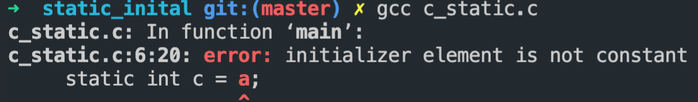

# C++基础知识

[思维导图](../MindMap/C++.xmind)

## 指针与数组

Q1: 数组的首地址的含义是什么 `arr, &arr[0], &arr`

````cpp
    int arr[10]={0};
    printf("%p\n",arr);//首元素的地址
    printf("%p\n",arr+1);
    // 这两种表达是等价的
    printf("%p\n",&arr[0]);//首元素的地址
    printf("%p\n",&arr[0]+1);

    printf("%p\n",&arr);//整个数组元素的地址
    printf("%p\n",&arr+1); // 输出为 arr + 10
````

Q2: `char *a`, `char **a`, `char (*a)[]`, `char a[]`, `char a[][]`之间的关系

​	**区分的关键在于，记住[]的优先级大于*.**

不管是一维还是多维数组，都是内存中一块线性连续空间，**因此在内存级别上，其实都只是一维。**

所以一维数组名是指向该数组的指针，二维数组名也是指向该数组的指针，但是+1之后，跳过的是一行。

Q3: 二维数组名为什么不能直接赋值给二级指针？

答：一句话来说就是**二维数组名是行指针，也就是指向数组的指针。而二级指针是指向指针的指针，它们不是同一类型。**

> 定义一维数组 `int a[i]` 和二维数组` int b[i][j]`，a相当于`int (*)`，而b相当于`int (*)[j]`。想要获得 a[i] 中第 x 个元素，可以直接使用 `*(a+x)`。而想要获得 `b[i][j] `中第 x 行第 y 个元素，则需用 `*(*(b+x)+y)`，因为 b 相当于数组指针，(b+x) 则是指向第 x 个数组的指针，注意，是指向数组，而不是数组元素！所以` *(b+x)` 获得的是第 x 个数组的数组名，即该数组的首元素地址，这时再结合偏移量 y 就可以取得该元素。

````cpp
#include <iostream>

using namespace std;

int main()
{
    cout << "=============" << endl;
    char a[] = "你好，全民制作人";
    char *b, tp[] = "我是蔡徐坤";
    char e = 'a', f = 'k';

    // b可以是指向数组的指针，也可以是指向变量的指针
    b = &e;
    printf("b可以是一个字符指针:%c \n", *b);
    // 在C++中，数组给指针赋值的时候，会降级为指向第一个元素的指针
    // 这个行为在反过来的时候是错误的
    // a = b; wrong!
    b = a;  // 当b指向a 他们直接没有任何区别
    printf("b指向数组: %s \n", b);
    printf("b也可以像a一样指向某个元素 %c \n", b[2]);
    

    char *c[2] = {a, tp}; // []的优先级大于* 因此这是一个指针数组
    char **d; // d同样有2种理解的方式，一个是二级指针，另一个是指向指针数组的指针 \
    也就是d和c是等价的

    b = &e; // b 再次指向一个字符
    d = &b;
    printf("修改之前 %c \n", **d);
    *d = &f; //让b指向f
    printf("修改之后 %c \n", *b);

    printf("这是指针数组中的内容: %s, %s \n", c[0], c[1]);
    d = c;
    printf("d 和 c是等价的 %s, %s \n", d[0], d[1]);

    char x[2][10] = {"丁真", "理塘"};
    char (*y)[10] = x; // 我们修改*的优先级，这样y首先是一个指针 \
    然后它指向了一个10个元素的数组，这就是二维数组
    printf("这是一个二维数组的指针: %s, %s \n", y[1], y[0]);

}
````


### 为什么不使用原始数组，而是vector or array

Raw arrays in C++ are kind of annoying and fraught with peril. This is why unless you have a very good reason to you should use `std::vector` or `std::array`.

First off, as others have said, `char[2]` is not the same as `char*`, or at least not usually. `char[2]` is a size 2 array of `char` and `char*` is a pointer to a `char`. They often get confused because arrays will decay to a pointer to the first element whenever they need to. So this works:

```cpp
char foo[2];
char* bar = foo;
```

But the reverse does not:

```cpp
const char* bar = "hello";
const char foo[6] = bar; // ERROR
```

Adding to the confusion, when declaring function parameters, `char[]` is equivalent to `char*`. So in your constructor the parameter `char short_name[2]` is really `char* short_name`.

Another quirk of arrays is that they cannot be copied like other types (this is one explanation for why arrays in function parameters are treated as pointers). So for example I can *not* do something like this:

```cpp
char foo[2] = {'a', 'b'};
char bar[2] = foo;
```

Instead I have to iterate over the elements of `foo` and copy them into `bar`, or use some function which does that for me such as [`std::copy`](http://en.cppreference.com/w/cpp/algorithm/copy):

```cpp
char foo[2] = {'a', 'b'};
char bar[2];
// std::begin and std::end are only available in C++11
std::copy(std::begin(foo), std::end(foo), std::begin(bar));
```

So in your constructor you have to manually copy the elements of `short_name` into `short_name_`:

```cpp
Territory::Territory(std::string name, char* short_name, Player* owner, 
                     char units) : name_(name), owner_(owner), units_(units)
{ 
    // Note that std::begin and std::end can *not* be used on pointers.
    std::copy(short_name, short_name + 2, std::begin(short_name));
}
```

As you can see this is all very annoying, so unless you have a very good reason you just should use `std::vector` instead of raw arrays (or in this case probably `std::string`).


## c++三大特性

### **封装**

最开始接触代码是C语言，那么开始写一些逻辑代码的时候会很麻烦，因为你要在函数中定义变量，然后按顺序写对应的逻辑，接着可以将逻辑封装成函数。当时会感觉很麻烦，因为很散装，知道后面学了struct结构体，把对应逻辑需要的数据可以放到一个结构体里面，这样就会比较好看。接着出现的问题就是数据封装到了一起，但是处理数据对应的逻辑即函数却还是在外面。因此就有了将数据和对应逻辑进行封装的类的出现。

封装就是将抽象得到的数据和行为相结合，形成一个有机的整体，也就是将数据与操作数据的源代码进行有机的结合，形成类，其中数据和函数都是类的成员，目的在于将对象的使用者和设计者分开，可以隐藏实现细节包括包含私有成员，使得代码模块增加安全指数，同时提高软件的可维护性和可修改性。

所以总结来说封装这个特性包含两三特点：

1. 结合性，即是将属性和方法结合
2. 信息隐蔽性，利用接口机制隐蔽内部实现细节，只留下接口给外界调用
3. 实现代码重用

### **继承**

类的派生指的是从已有类产生新类的过程。原有的类成为基类或父类，产生的新类称为派生类或子类，子类继承基类后，可以创建子类对象来调用基类的函数，变量等。

一般来说有如下三种继承方式：

1. 单一继承：继承一个父类，这种继承称为单一继承，这也是我们用的做多的继承方式。
2. 多重继承：一个派生类继承多个基类，类与类之间要用逗号隔开，类名之前要有继承权限，假使两个或两个基类都有某变量或函数，在子类中调用时需要加**类名限定符**如obj.classA::i = 1；
3. 菱形继承：多重继承掺杂隔代继承1-n-1模式，此时需要用到虚继承，例如 B，C虚拟继承于A，D再多重继承B，C，否则会出错。后面有将具体虚继承怎么做。

此外还有继承权限的问题，如下图：

> public、protected、private三种继承方式，相当于把父类中的，比继承权限大的权限在子类中变成了继承时的权限。


[](https://camo.githubusercontent.com/2ac72d71dc9735144f15b03ce2c9ec548f6e01885a0adc2185d9765217bd9ffd/68747470733a2f2f696d61676573323031352e636e626c6f67732e636f6d2f626c6f672f313034383433302f3230313631312f313034383433302d32303136313130373039353635373238302d313531393131323032392e706e67)

### **多态**

可以简单概括为“一个接口，多种方法”，即用的是同一个接口，但是效果各不相同，多态有两种形式的多态，一种是静态多态，一种是动态多态。

静态多态。静态多态的设计思想：对于相关的对象类型，直接实现它们各自的定义，不需要共有基类，甚至可以没有任何关系。只需要各个具体类的实现中要求相同的接口声明，静态多态本质上就是模板的具现化。

动态多态。对于相关的对象类型，确定它们之间的一个共同功能集，然后在基类中，把这些共同的功能声明为多个公共的虚函数接口。各个子类重写这些虚函数，以完成具体的功能。具体实现就是c++的虚函数。

多态是以封装和继承为基础实现的性质，一个形态的多种表现方式。硬要解释的话可以说是一个接口，多个功能，在用父类指针调用函数时，实际调用的是指针指向的实际类型（子类）的成员函数。

c++多态有以下几种：

1. 重载。函数重载和运算符重载，编译期。

2. 虚函数。子类的多态性，运行期。

   在继承关系中，对于父类的方法我们也同样使用。但是正常来说，我们希望方法的行为取决于调用方法的对象，而不是指针或引用指向的对象有关。

3. 模板，类模板，函数模板。编译期

> 比如你家有亲属结婚了，让你们家派个人来参加婚礼，邀请函写的是让你爸来，但是实际上你去了，或者你妹妹去了，这都是可以的，因为你们代表的是你爸，但是在你们去之前他们也不知道谁会去，只知道是你们家的人。可能是你爸爸，可能是你们家的其他人代表你爸参加。这就是多态。

## 面向对象和面向过程语言的区别

首要要知道这两个都是一种编程思想

**面向过程**就是分析出解决问题所需要的步骤，然后用函数把这些步骤一步一步实现，使用的时候一个一个依次调用就可以了。

**面向对象**是把构成问题事务分解成各个对象，建立对象的目的不是为了完成一个步骤，而是为了描叙某个事物在整个解决问题的步骤中的行为。

**举一个例子：**

例如五子棋，面向过程的设计思路就是首先分析问题的步骤：1、开始游戏，2、黑子先走，3、绘制画面，4、判断输赢，5、轮到白子，6、绘制画面，7、判断输赢，8、返回步骤2，9、输出最后结果。把上面每个步骤用分别的函数来实现，问题就解决了。

而面向对象的设计则是从另外的思路来解决问题。整个五子棋可以分为 1、黑白双方，这两方的行为是一模一样的，2、棋盘系统，负责绘制画面，3、规则系统，负责判定诸如犯规、输赢等。第一类对象（玩家对象）负责接受用户输入，并告知第二类对象（棋盘对象）棋子布局的变化，棋盘对象接收到了棋子的i变化就要负责在屏幕上面显示出这种变化，同时利用第三类对象（规则系统）来对棋局进行判定。

可以明显地看出，面向对象是以功能来划分问题，而不是步骤。同样是绘制棋局，这样的行为在面向过程的设计中分散在了总多步骤中，很可能出现不同的绘制版本，因为通常设计人员会考虑到实际情况进行各种各样的简化。而面向对象的设计中，绘图只可能在棋盘对象中出现，从而保证了绘图的统一。功能上的统一保证了面向对象设计的可扩展性。

**面向过程**

优点：性能比面向对象高，因为类调用时需要实例化，开销比较大，比较消耗资源;比如单片机、嵌入式开发、 Linux/Unix等一般采用面向过程开发，性能是最重要的因素。

缺点：没有面向对象易维护、易复用、易扩展

**面向对象**

优点：易维护、易复用、易扩展，由于面向对象有封装、继承、多态性的特性，可以设计出低耦合的系统，使系统 更加灵活、更加易于维护

缺点：性能比面向过程低

## 结构体(struct)和共同体(union)的区别

结构体struct：把不同类型的数据组合成一个整体。struct里每个成员都有自己独立的地址。sizeof(struct)是内存对齐后所有成员长度的加和。

共同体union：各成员共享一段内存空间, 一个union变量的长度等于**各成员中最长的长度**，以达到节省空间的目的。所谓的共享不是指把多个成员同时装入一个union变量内, 而是指该union变量可被赋予任一成员值,但每次只能赋一种值, 赋入新值则冲去旧值。 sizeof(union)是最长的数据成员的长度。

> 总结： struct和union都是由多个不同的数据类型成员组成, 但在任何同一时刻, union中只存放了一个被选中的成员, 而struct的所有成员都存在。在struct中，各成员都占有自己的内存空间，它们是同时存在的。一个struct变量的总长度等于所有成员长度之和。**在Union中，所有成员不能同时占用它的内存空间，它们不能同时存在。**Union变量的长度等于最长的成员的长度。对于union的不同成员赋值, 将会对其它成员重写, 原来成员的值就不存在了, 而对于struct的不同成员赋值是互不影响的。

### struct的内存对齐规则

[博客链接](https://cloud.tencent.com/developer/article/1703257)

### **为什么要字节对齐？**

需要字节对齐的根本原因在于CPU访问数据的效率问题。假如没有字节对齐，那么一个double类型的变量会存储在4-11上（正常是0-7）这样计算机取这个数据的会会取两次，降低效率。而如果变量在自然对齐位置上，则只要一次就可以取出数据。一些系统对对齐要求非常严格，比如sparc系统，如果取未对齐的数据会发生错误。

### **对齐规则**

有效对其值：是给定值#pragma pack(n)和结构体中最长数据类型长度中较小的那个。有效对齐值也叫**对齐单位**。

对齐规则

> 在没有#pragma pack这个宏的声明下，遵循下面三个原则：
>
> 1、第一个成员的首地址为0.
>
> 2、每个成员的首地址是自身大小的整数倍
>
> 3、结构体的总大小，为其成员中所含最大类型的整数倍。
>
> 在存在#pragma pack这个宏的声明时，
>
> 对齐值是 **结构体中成员长度最大的值和对其值的最小值**。


举例子：

```CPP
typedef struct A {
    char a;   //1+3
    int  b;    //4
    short c;    //2+2
		// 总大小12 A的对齐值为4
} AA;

#pragma  pack(8)
// 最大的长度为4字节 实际的对齐值为 4
struct test
{
  char a; // 1 + 3
  int  b; // 4
  short c; // 4
  // 总大小为: 12
};
```

**易错点**

```C++
//sizeof = 8
struct str{
    char p; // 1 + 3
    int a; // 4
    int b[0]; // 0
}

//sizeof = 4
struct str{
    int b[0];
}

//sizeof = 1
struct str{
    
}
```

### [空数组与空结构体](https://blog.csdn.net/LU_ZHAO/article/details/104225048)

上面三个结构体都包含空数组，空数组指的是长度为0的数组`int[]`或`int[0]`

这种定义只能在类或者结构体中定义，在外部是非法定义。空数组不占空间，也无需初始化

>  空数组名是一个指针，（但是又不占空间）指向一个位置；对于结构体，空数组名这个指针指向了前面一个成员结束的第一个空间。

空数组的用法，用来申请空间

````cpp
typedef struct st{
    int c;
    char a[0];
} s;

int main() {
    s *a = static_cast<s *>(malloc(sizeof(int) + 20));
    char *c  = a->a;
    c = "wo shi ikun";
    printf("%p  %s\n", &(a->c), c);
    return 0;
}
````


空类和空结构体为什么不能为空?

> “no object shall have the same address in memory as any other variable” ，就是任何不同的对象不能拥有相同的内存地址。 如果空类大小为0，若我们声明一个这个类的对象数组，那么数组中的每个对象都拥有了相同的地址，这显然是违背标准的。

### 结构体位域(bitfield)

C/C++中以一定区域内的位(bit)为单位来表示的数据成为位域，**位域必须指明具体的数目**。

位域的作用主要是节省内存资源，使数据结构更紧凑。

1. 位域的值不能超过数据本身的最大值。
2. 我们无法获取位域的地址。
3. 对位域的元素赋超过的值 会发生数据的截断，而不会覆盖。

位域的使用规则：

> 1. 如果相邻位域字段的类型相同，且其位宽之和小于类型的sizeof大小，则后面的字段将紧邻前一个字段存储，直到不能容纳为止；
> 2. 如果相邻位域字段的类型相同，但其位宽之和大于类型的sizeof大小，则后面的字段将从新的存储单元开始，其偏移量为其类型大小的整数倍；
> 3. 如果相邻的位域字段的类型不同，则各编译器的具体实现有差异，VC6采取不压缩方式，Dev-C++采取压缩方式；
> 4. 如果位域字段之间穿插着非位域字段，则不进行压缩；
> 5. 整个结构体的总大小为最宽基本类型成员大小的整数倍。

```C
// test结构体的size为一个字节，说明char类型的位域和int类型的位域存储在同一个字节当中。
typedef struct {
    int a : 16;
    char d : 4;
    int b : 12;
} test;
typedef struct {
    int b : 25;
    int : 0; // 无名位域，用于填充，0代表填充满剩下的字节
    int c: 4;
} test;
在clang和g++中，为一个字节
 
内存布局     	高地址
 |				 |
 |	1111	 | a的位置
 |	0011	 | d的位置
 |				 | 
 |				 | 低地址
 ----------|
  说明，位域是向高地址低地址延伸
typedef struct {
    int a : 4;
    int d : 4;
    int b : 25;
} test;
int main() {
    test *c = new test;
    int *p = (int *)c;
    *p = 0x0000003f;
    // 低地址是高位
    // a 1111
    // d 0011
    printf("%d, %d \n", c->a, c->d);
    return 0;
}
```


## C++内存布局/程序分段

也可以叫做进程逻辑地址空间

内存从上到下分别是：

- 栈stack |高地址|
- 堆heap
- bss段
- data段
- 代码段text |低地址|

栈：保存函数的局部变量，参数以及返回值。在函数调用后，系统会清楚栈上保存的栈帧和局部变量，函数参数等信息。栈是从高到低增长的。

堆：动态内存分配的都放在堆上。堆是从低到高的。

bss段：（Block Started by Symbol）存放程序中未初始化的全局变量和static变量的一块内存区域，在程序载入时由内核置为0。

>  **注意，并不是所有的变量都会被放入bss中，全局的未初始化变量可能不在bss中。**

data段：初始化的static变量和初始化的全局变量都在data段中。

> bss段和data段都是静态内存分配，也就是说在编译的时候自动分配的。
>
> bss和data段也有一种说法合起来叫数据段，有三种类型：
>
> 1. 只读数据段，常量与const修饰的全局变量
> 2. 可读可写数据段，存放初始化的全局变量和static变量
> 3. bss段，存放未初始化的全局变量

text段：代码段，text段在内存中被映射为只读，但.data和.bss是可写的。由编译器在编译连接时自动计算的，当你在链接定位文件中将该符号放置在代码段后，那么该符号表示的值就是代码段大小，编译连接时，该符号所代表的值会自动代入到源程序中。

## **static 和const**

- **static**

  - static对于变量

    1. 局部变量

       在局部变量之前加上关键字static，局部变量就被定义成为一个局部静态变量。

       内存中的位置：data段

       初始化：局部的静态变量只能被初始化一次

       作用域：作用域仍为**局部作用域**，当定义它的函数或者语句块结束的时候，作用域随之结束。

       注意，虽然理论上作用域失效，但实际上我们可以访问他的内存。

       ````cpp
       int* func() {
           static int c = 5;
           return &c;
       }
       int main() {
           int *p = func();
           *p = 10;
           cout << *p <<endl;
           return 0;
       }
       ````

       > 当static用来修饰局部变量的时候，它就**改变了局部变量的存储位置（从原来的栈中存放改为静态存储区）及其生命周期（局部静态变量在离开作用域之后，并没有被销毁，而是仍然驻留在内存当中，直到程序结束，只不过我们不能再对他进行访问），但未改变其作用域。**

    2. 全局变量

       在全局变量之前加上关键字static，全局变量就被定义成为一个全局静态变量。

       内存中的位置：静态存储区（静态存储区在整个程序运行期间都存在）

       初始化：未经初始化的全局静态变量会被程序自动初始化为0

       作用域：**全局静态变量在声明他的文件之外是不可见的**。准确地讲从定义之处开始到文件结尾。(只能在本文件中存在和使用)

       > 全局变量本身就是静态存储方式， 静态全局变量当然也是静态存储方式。两者的区别在于非静态全局变量的作用域是整个源程序， 当一个源程序由多个源文件组成时，非静态的全局变量在各个源文件中都是有效的（在其他源文件中使用时加上extern关键字重新声明即可）。 而**静态全局变量则限制了其作用域， 即只在定义该变量的源文件内有效， 在同一源程序的其它源文件中不能使用它**。

  - static对于函数

    修饰普通函数，表明函数的作用范围，仅在定义该函数的文件内才能使用。在多人开发项目时，为了防止与他人命名空间里的函数重名，可以将函数定位为 static。（和全局变量一样限制了作用域而已）

  - static对于类

    1. 成员变量

       用static修饰类的数据成员实际使其成为类的全局变量，会被类的所有对象共享，包括派生类的对象。

       因此，**static成员必须在类外进行初始化，而不能在构造函数内进行初始化。不过也可以用const修饰static数据成员在类内初始化 。**

    2. 成员函数

       用static修饰成员函数，使这个类只存在这一份函数，所有对象共享该函数，不含this指针。

       静态成员是可以独立访问的，也就是说，无须创建任何对象实例就可以访问。

       **不可以同时用const和static修饰成员函数。**

- **const**

  1. const修饰变量：限定变量为不可修改。

  2. const修饰指针：指针常量和指向常量的指针

  3. const和函数：有以下几种形式

     ```CPP
     const int& fun(int& a); //修饰返回值
     int& fun(const int& a); //修饰形参
     int& fun(int& a) const{} //const成员函数
     ```

  4. const和类：①const修饰成员变量，在某个对象的声明周期内是常量，但是对于整个类而言是可以改变的。因为类可以创建多个对象，不同的对象其const成员变量的值是不同的。切记，**不能在类内初始化const成员变量**，因为类的对象没创建前，编译器并不知道const成员变量是什么，因此const数据成员**只能在初始化列表中初始化**。②const修饰成员函数，主要目的是防止成员函数修改成员变量的值，即该成员函数并不能修改成员变量。③const对象，常对象，常对象只能调用常函数。

  5. 限定成员函数不可以修改任何数据成员

- static和const可以同时修饰成员函数吗?

  答：不可以。C++编译器在实现const的成员函数的时候为了确保该函数不能修改类的实例的状态，会在函数中添加一个隐式的参数const this*。但当一个成员为static的时候，该函数是没有this指针的。也就是说此时const的用法和static是冲突的。两者的语意是矛盾的。**static的作用是表示该函数只作用在类型的静态变量上，与类的实例没有关系；而const的作用是确保函数不能修改类的实例的状态**，与类型的静态变量没有关系。因此不能同时用它们。

````cpp
static int out; //全局静态变量，不可以被extern
static void print() {
    cout << "我不可以被extern" << endl;
}
class C {
public:
    static int b; //我只能通过类外初始化
    static void print_static() {
        cout << "我属于整个类" << endl;
    }
    const static int d; // 需要再类内被初始化, 默认为0
    const int c = 4; // 可以指定初值，会被列表构造器覆盖,如果没有指定，那么无参构造函数必须指定
    void print() const {};
    C(int c):c(c){}; // 我必须在初始化的时候指定c的值 而且必须通过列表初始化
    C(){};
};
int main() {
    static int a; // 静态局部变量
    C c;
    cout << c.c << endl;
    return 0;
}
````

### static静态局部变量的初始化时机问题

在c语言中：

静态局部变量和全局变量一样，数据都存放在全局区域，所以在主程序之前，编译器已经为其分配好了内存，**在编译阶段分配好了内存之后就进行初始化**，在程序运行结束时变量所处的全局内存会被回收。所以在**c语言中无法使用变量对静态局部变量进行初始化。**



对静态变量的赋值必须是常量。

对于C++而言

c++主要引入了类这种东西，要进行初始化必须考虑到相应的构造函数和析构函数，而且很多时候构造或者析构函数中会指定我们定义的操作，并非简单的分配内存。因此为了造成不必要的影响（一些我不需要的东西被提前构造出来）**所以c++规定全局或者静态对象在首次用到的时候才会初始化。**