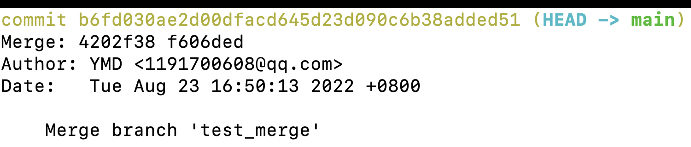

# git使用场景的总结

git 指令的[思维导图](../MindMap)

## 场景1 取消对文件的追踪

有时候在项目开发过程中，突然心血来潮想把某些目录或文件加入忽略规则，按照上述方法定义后发现并未生效，**原因是.gitignore只能忽略那些原来没有被track的文件，如果某些文件已经被纳入了版本管理中，则修改.gitignore是无效的**。那么解决方法就是先把本地缓存删除（改变成未track状态），然后再提交：

````shell
git rm -r --cached <file>　　# 不删除本地文件

git rm -r <file>  　　# 删除本地文件

# 操作方法
git rm -r --cached .
git add .
git commit -m 'update .gitignore'
````

## 场景2 关联远程的仓库，对远程分支进行一系列的操作

- 关联远程仓库与分支

```shell
git remote add <repo> # 添加一个远程版本库关联
git remote rm  <repo> # 删除某个远程版本库关联

git push -u origin master  # 表示把当前仓库的当前的分支和远端仓库的 master 分支关联起来，后面我们执行 push 或者 pull 都可以非常方便的进行操作了
# 关联分支的操作也可以通过以下指令实现
git branch -u master origin/master 
```

- 远程分支创建与删除

````shell
$ git push origin <local_branch>:<remote_branch> # 本地的分支推送到远程,如果不存在，就创建
$ git push origin :<remote_branch> # 两种删除方式 推送一个空分支到远程分支，其实就相当于删除远程分支
$ git push origin --delete <remote_branch>

````

## 场景3 本地分支的管理

````shell
//新建分支
git branch 分支名
//切换分支
git checkout 分支名

//删除本地分支
git branch -d 分支名
//强制删除本地分支
git branch -D 分支名

//查看本地所有分支
git branch
//查看远程所有分支
git branch -r
//查看远程和本地所有分支—一般用这个
git branch -a

//重命名本地分支
git branch -m <oldbranch> <newbranch>
````


## 场景4 分支合并 merge与rebase

git merge 会让2个分支的提交按照提交时间进行排序，并且会把最新的2个commit合并成一个commit。最后的分支树呈现非线性的结构

````shell
git merge <branch> 将branch合并到当前的分支当中
````


git rebase 将dev的当前提交复制到master的最新提交之后，会形成一个线性的分支树, 原来的分支会消失不见

````shell
git rebase <branch> # 将当前分支rebase到branch分支当中
````


查看git log 我们可以发现最新的提交中，没有之前分支的信息



在source tree中，我们可以看到相应的信息。


## 场景5 各个阶段的撤回操作

1. 修改了内容，还未提交到暂存区，恢复到上一次commit的代码

   ````shell
   git restore <file>
   ````

2. 修改了内容, 提交到暂存区

   ````shell
   git restore --staged <file> # 将文件从暂存区移除，如果想要复原，执行操作1
   ````

3. 已经提交了commit

   ````shell
   git reset --soft HEAD^|<commit版本号>
   
   撤销我们的commit
   --mixed 
   意思是：不删除工作空间改动代码，撤销commit，并且撤销git add . 操作
   这个为默认参数,git reset --mixed HEAD^ 和 git reset HEAD^ 效果是一样的。
   --soft  
   不删除工作空间改动代码，撤销commit，不撤销git add . 
   --hard
   删除工作空间改动代码，撤销commit，撤销git add . 
   注意完成这个操作后，就恢复到了上一次的commit状态。
   HEAD^的意思是上一个版本，也可以写成HEAD~1
   如果你进行了2次commit，想都撤回，可以使用HEAD~2
   
   ````

   